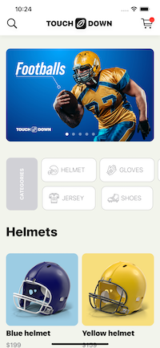
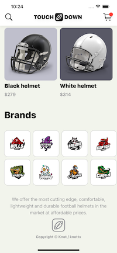
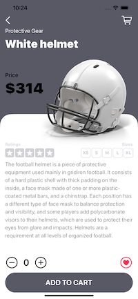

# touchdown-sample-ios
Sample SwiftUI App
- @Environment property wrapper
- Observable Object property wrapper
- Custom navigation bar
- Custom shape with Shape Path
- Horizontal grid layouts

  
